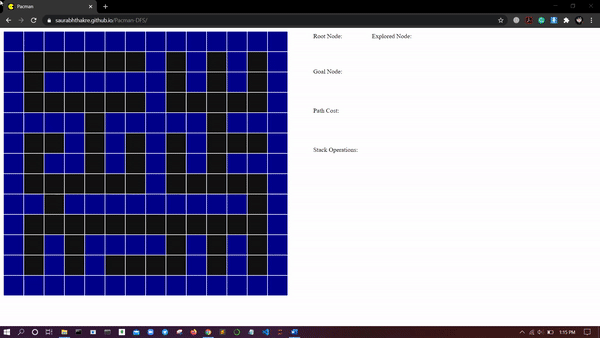

# Pacman-DFS
AI Assignment - Move Pacman using Depth First Search (DFS) Algorithm.



Play using this link: https://saurabhthakre.github.io/Pacman-DFS/

## Procedure
* If pacman is not present:
```
1. Click on any empty cell to set the Pacman initial position.
2. Click on any another cell to set as Goal node.
```
* Else:
```
1. Click on any another cell to set as Goal node.
```

## Warning
* Do not Click on any empty cell while pacman is moving.
* It will Misbehave or not reach the new selected goal.
